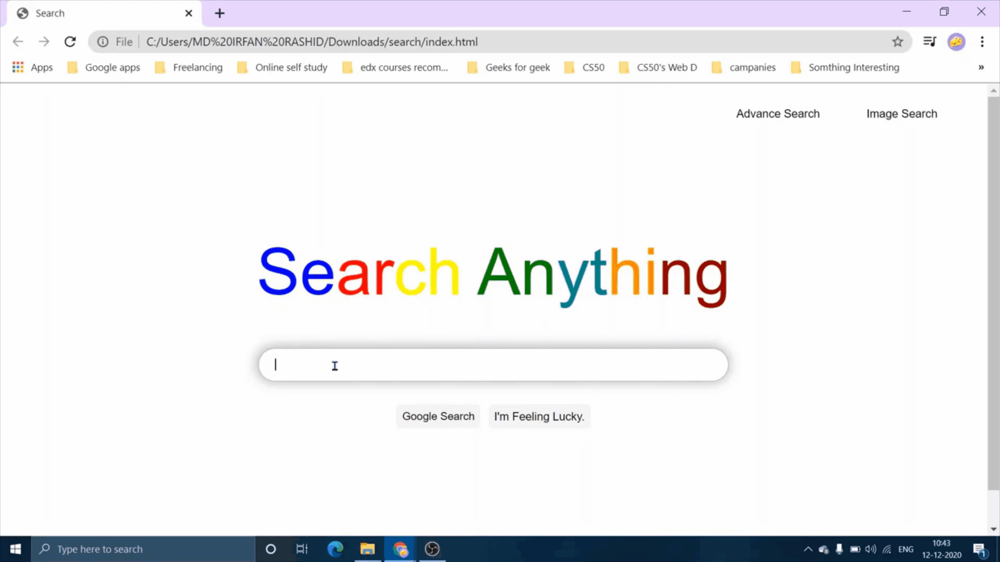
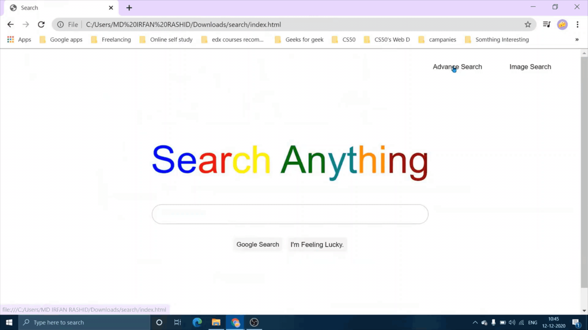

# Search 
Design a front-end for Google Search, Google Image Search, and Google Advanced Search.

## Overview
Search is the zeroth project for Harvard CS50's Web Programming with Python and JavaScript course. The project specifications are listed [here](https://cs50.harvard.edu/web/2020/projects/0/search/).

## Project Demos
A [full demo of my project](https://youtu.be/41f2yAE5AAw) can be viewed on YouTube along with my all [other CS50 Web Projects](https://www.youtube.com/playlist?list=PL6kIwIV_2O_gfcx46gplsaybo8c9vTb3d).

Note the quality of the following clips may be lower due to conversion from video to GIF format.  

### Search 

###  Image Search

###  Advanced Search 

###  Feeling Lucky. 

## Bug Reports and Improvements
If you experience any bugs or see anything that can be improved or added, please feel free to [open an issue](https://github.com/IrfanTheDev/Search/issues) <!-- update the link --> here or simply contact me through any of the methods below.
 Thanks in advance!

Email: theirfan2020@gmail.com   
Linkedin: [https://www.linkedin.com/in/theirfanr/](https://www.linkedin.com/in/theirfanr/)

